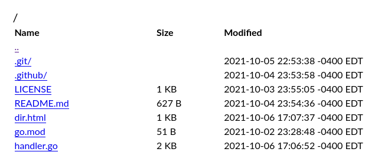

# fsbrowse
[](https://github.com/thatoddmailbox/fsbrowse/actions/workflows/build.yml)



A Go module that provides a web UI to browse an [fs.FS](https://pkg.go.dev/io/fs#FS). Effectively a slightly nicer-looking version of [http.FileServer](https://pkg.go.dev/net/http#FileServer).

Requires Go 1.16 or newer, due to the usage of fs.FS. Also, the fs.FS being used must implement [io.Seeker](https://pkg.go.dev/io#Seeker) and [fs.ReadDirFile](https://pkg.go.dev/io/fs#ReadDirFile) on its files.

## Usage
The module exports one function, `FileServer`, which accepts an fs.FS and returns an http.Handler. Here's an example of how you might use this in practice:

```go
root := os.DirFS("./some/path/somewhere")
http.ListenAndServe(":9876", fsbrowse.FileServer(root))
```